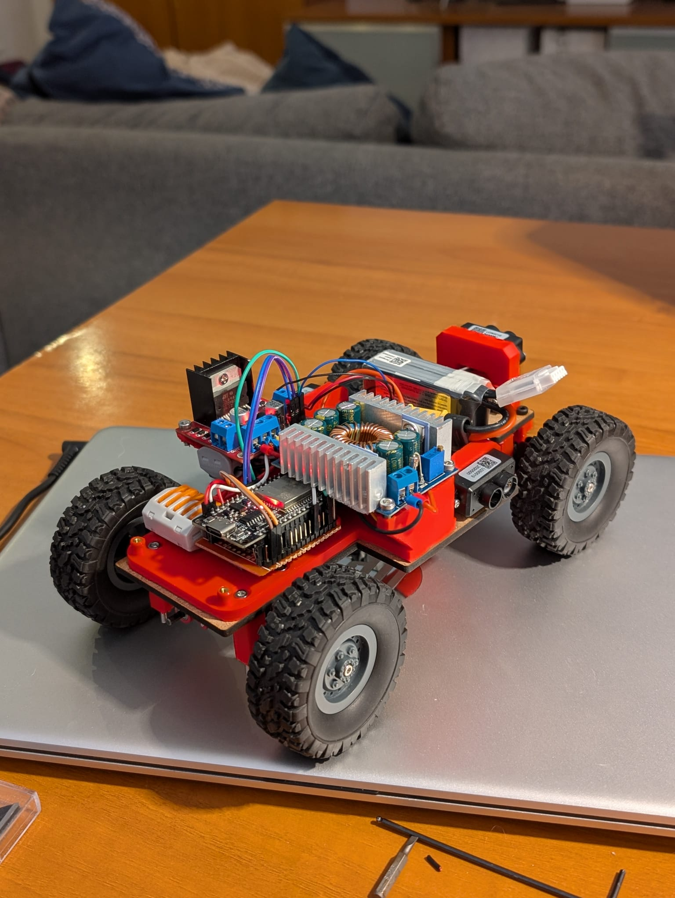
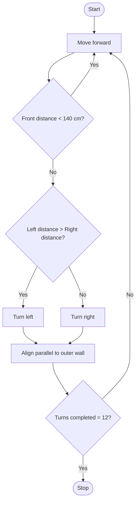

# NotAPi_WRO_2025

## 1. Mobility Management

For this version of the car we opted for a fresh start, we bought an [axle set](https://es.aliexpress.com/item/1005004716882834.html?gatewayAdapt=glo2esp) for managing directions and a pair of wheels to compliment it. Steering is controlled by a servo connected to the front axle, allowing it to turn in a fast manner.
For propulsion, we're using a recycled motor extracted from a dead vacuum cleaner, which we have tracked as being a [Transmotec GR-18260-CVC](https://www.transmotec.de/product/GR-18260-CVC/). For the previous car we made a pair of custom gears to reduce the speed and augment the torque, unfortunately, due to space constraints, we weren't able to use them (even though they aren't really necessary as the motor has enough torque to move the vehicle). The motor is managed by an L298N module, this provides us easy motor control. All additional structural components were 3D-printed or [lasercut](https://github.com/Pegoku/Diode-Laser-Cutter) for lightweight, durability and modularity and all models are available [here](https://github.com/NotAPi/NotAPi_WRO/tree/2025/Models).

**Key Features:**

- Servo-driven steering with 60º range
- New axle made specially for rc cars giving us a huge advantage in control, reliability and speed.
- A new motor with great power and rated for 12V, giving us a lot of torque and speed.
- Lightweight design with 3D-printed and lasercut components for durability and modularity.

---

## 2. Power and Sensor Management

### Power System

The robot is powered by a [650mAh 4S Li-Po battery](https://www.ihobbies.es/p?idsite=1&idioma=50&pdt_id=20281&error=solicitar_info&desc=).
To eficiently distribute the power, we used two step-down regulators:

- An adjustable Buck regulator (set to 12V) for the motor to allow it to yield optimal thrust in short periods of time, without the risk of overvolting it.
- A 5V LDO for all other components, as they don't draw much current.

### Sensors

The car currently employs a system of the following sensors:

- 3x LIDARs: LIDAR is a Time of Flight laser technology that allows for great precision and prevents interference from natural and ambience light, which was a weak spot for our previous sensors.
  They are located as follows:
- Front: Used to measure the distance of the walls and prevent the car from crashing into them.
- Both Sides: Used to measure distance of the walls, and used to know when and where to turn.
  They were set to I2C mode, and each one was assigned a different address using the [TF-Mini Plus library](https://github.com/budryerson/TFMini-Plus-I2C).
- Camera: Not used anymore.

### Schematic

A schematic of the electrical connections can be found [here](resources/schematic.pdf)

### BOM

| Items                | Quantity | Links                                                                     | Brief Description                                                           |
| -------------------- | -------- | ------------------------------------------------------------------------- | --------------------------------------------------------------------------- |
| TF-Mini              | x3       | https://es.aliexpress.com/item/1005009430996831.html                      | Great Lidars now with the addition of (library for the tof)                 |
| Buck Regulator       | x1       | https://es.aliexpress.com/item/1005004880411857.html                      | For the motor                                                               |
| L298N module         | x1       | https://es.aliexpress.com/item/1005007650595037.html                      | Dual H-Bridge motor driver with integrated 5V regulator                     |
| DC motor (similar)   | x1       | https://www.transmotec.de/product/GR-18260-CVC/                           | Recycled from a vacuum cleaner, rated for 12V and with great torque         |
| front and back Axles | x2       | https://es.aliexpress.com/item/1005004716882834.html?gatewayAdapt=glo2esp | Axle set that allows for the vehicle to maintain stability                  |
| Wheels               | x4       | https://es.aliexpress.com/item/1005006889490468.html                      | Good wheels that although they often slip out. They pair well with the axle |
| ESP-32               | x1       | https://es.aliexpress.com/item/1005006456519790.html                      | Main controller, chosen for its power and ease of use                       |
| Servo                | x1       | https://es.aliexpress.com/item/4000903254039.html                         | Used for steering                                                           |
| Battery              | x1       | https://www.ihobbies.es/p?idsite=1&idioma=50&pdt_id=20281                 | Provides power to the entire system                                         |
| Motor                | x1       | https://www.transmotec.es/product/GR-18260-CVC/                           | Drives the vehicle forward                                                  |

---

## 3. Obstacle Management & Navigation Logic

The car autonomously navigates by:

1. **Advancing** until the front wall is ~140cm away.
2. **Measuring distances** to walls (sides) using the ToF sensors.
3. **Checking side distances** to determine the optimal turning direction (away from closer obstacles).
4. **Executing turns** until the outer sensor detects an increase of the distance, as it indicates the car has rotated +90º.
5. **Repeat** until the battery runs out, the sensors fail or we manually stop the car, as it currently doesn't have a way to check when it has made all 12 turns.

This can be summarized in the following logic diagram:

```mermaid
flowchart TD
  Start([Start]) --> Forward[Move forward]
  Forward --> Fdist{Front distance < 140 cm?}
  Fdist -- Yes --> Forward
  Fdist -- No --> SideCheck{Left distance > Right distance?}
  SideCheck -- Yes --> TurnLeft[Turn left]
  SideCheck -- No --> TurnRight[Turn right]
  TurnLeft --> Align[Align parallel to outer wall]
  TurnRight --> Align
  Align --> Count{Turns completed = 12?}
  Count -- No --> Forward
  Count -- Yes --> Stop([Stop])
```

---

## 4. Pictures

### Team Picture

# TODO

### Car Pictures

  
Car pictures (click to expand)

  
  
  
  
  

## 5. Performance Videos

# TODO

[Demo](https://hc-cdn.hel1.your-objectstorage.com/s/v3/c7cb69626a8cc83b544aa8f92fb21f2a090f1fee_pxl_20250423_193522126_2.mp4)
[Demo2](https://hc-cdn.hel1.your-objectstorage.com/s/v3/c7cb69626a8cc83b544aa8f92fb21f2a090f1fee_pxl_20250423_193522126_2.mp4)
[Demo3](https://hc-cdn.hel1.your-objectstorage.com/s/v3/c7cb69626a8cc83b544aa8f92fb21f2a090f1fee_pxl_20250423_193522126_2.mp4)