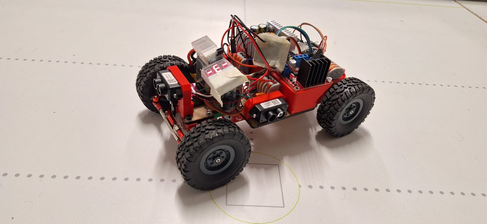
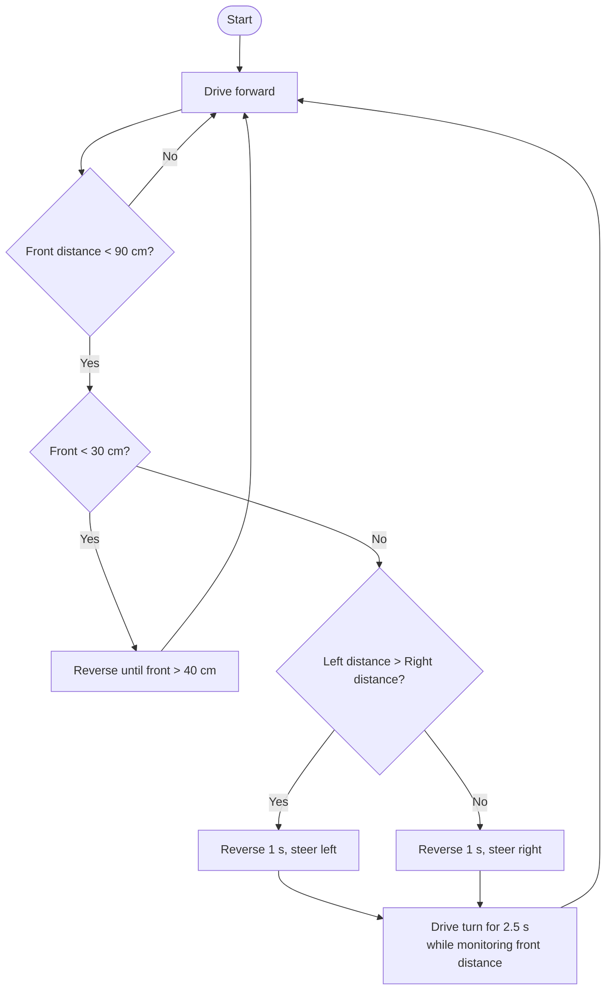
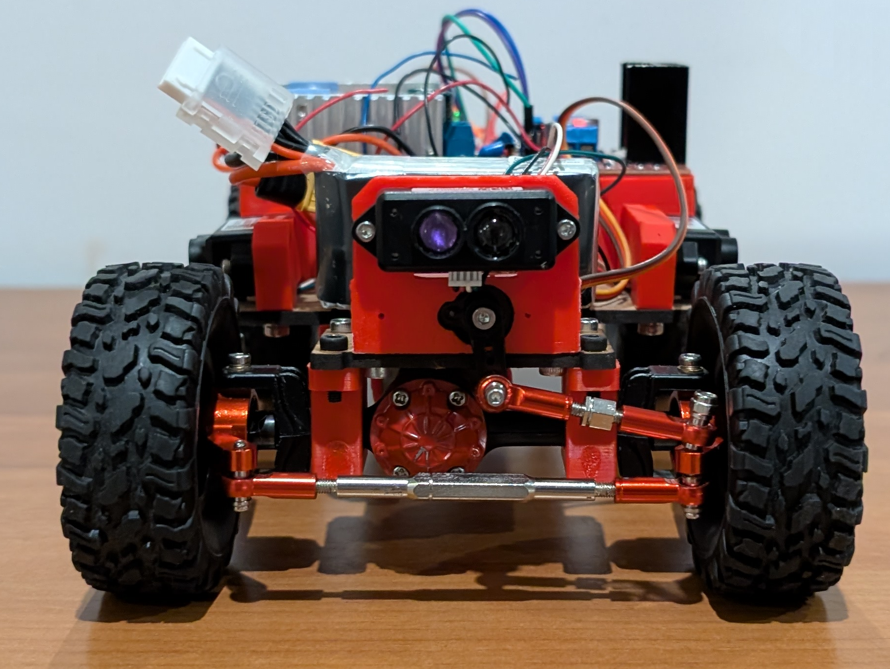
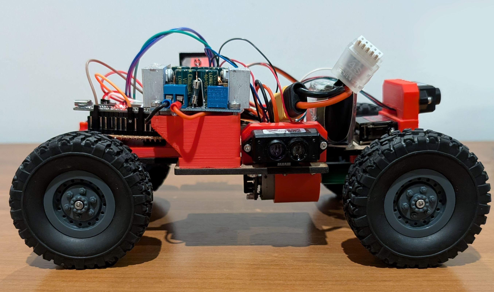
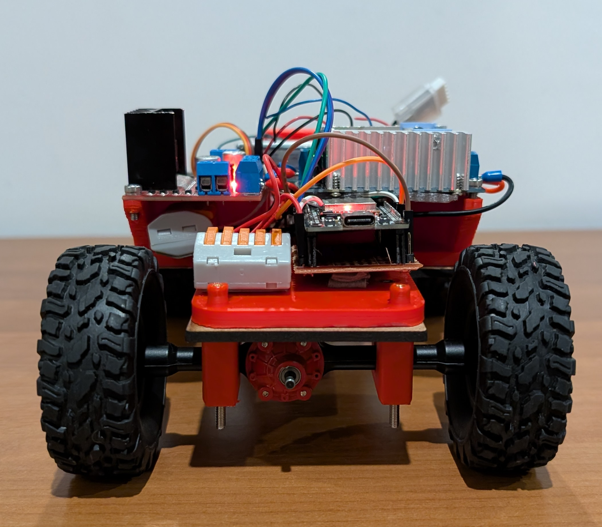
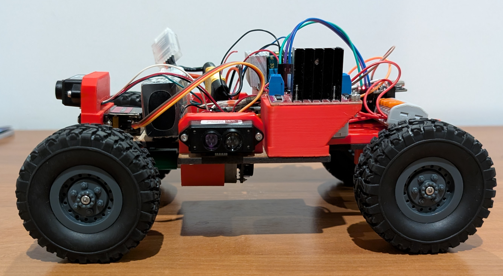
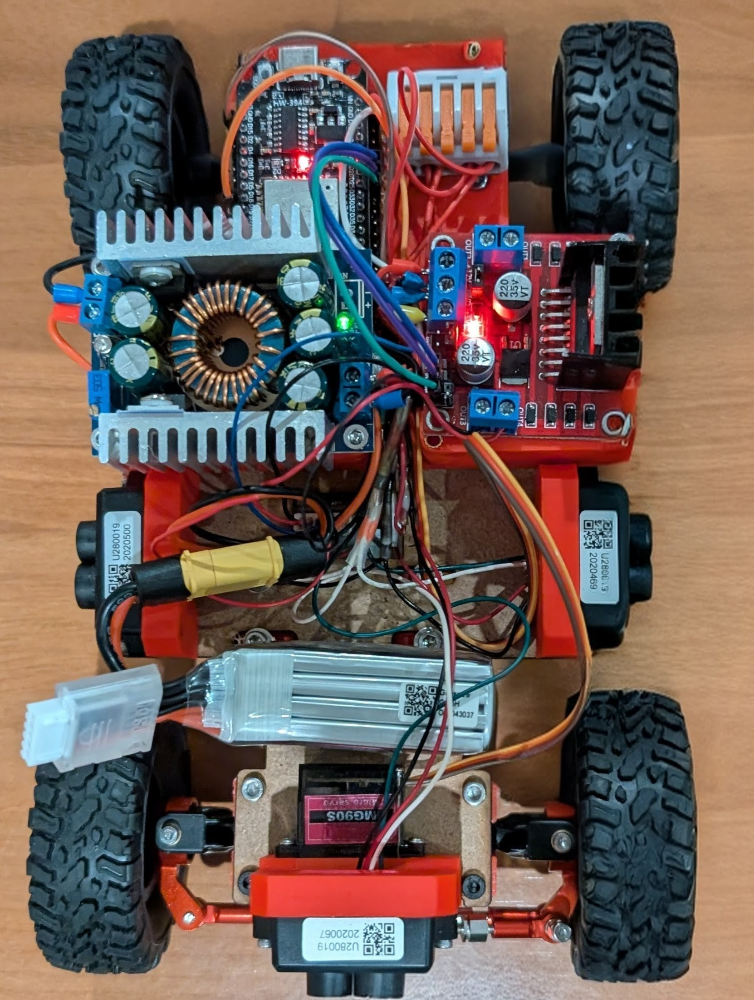

# NotAPi_WRO_2025




## 1. Mobility Management

For this version of the car we opted for a fresh start, we bought an [axle set](https://es.aliexpress.com/item/1005004716882834.html?gatewayAdapt=glo2esp) for managing directions and a pair of wheels to compliment it. Steering is controlled by a servo connected to the front axle, allowing it to turn in a fast manner.
For propulsion, we're using a recycled motor extracted from a dead vacuum cleaner, which we have tracked as being a [Transmotec GR-18260-CVC](https://www.transmotec.de/product/GR-18260-CVC/). For the previous car we made a pair of custom gears to reduce the speed and augment the torque, unfortunately, due to space constraints, we weren't able to use them (even though they aren't really necessary as the motor has enough torque to move the vehicle). The motor is managed by an L298N module, this provides us easy motor control. All additional structural components were 3D-printed or [lasercut](https://github.com/Pegoku/Diode-Laser-Cutter) for lightweight, durability and modularity and all models are available [here](https://github.com/NotAPi/NotAPi_WRO/tree/2025/Models).

**Key Features:**

- Servo-driven steering with 60º range
- New axle made specially for rc cars giving us a huge advantage in control, reliability and speed.
- A new motor with great power and rated for 12V, giving us a lot of torque and speed.
- Lightweight design with 3D-printed and lasercut components for durability and modularity.

---

## 2. Power and Sensor Management

### Power System

The robot is powered by a [650mAh 4S Li-Po battery](https://www.ihobbies.es/p?idsite=1&idioma=50&pdt_id=20281&error=solicitar_info&desc=).
To eficiently distribute the power, we used two step-down regulators:

- An adjustable Buck regulator (set to 12V) for the motor to allow it to yield optimal thrust in short periods of time, without the risk of overvolting it.
- A 5V LDO for all other components, as they don't draw much current.

### Sensors

The car currently employs a system of the following sensors:

- 3x LIDARs: LIDAR is a Time of Flight laser technology that allows for great precision and prevents interference from natural and ambience light, which was a weak spot for our previous sensors.
  They are located as follows:
- Front: Used to measure the distance of the walls and prevent the car from crashing into them.
- Both Sides: Used to measure distance of the walls, and used to know when and where to turn.
  They were set to I2C mode, and each one was assigned a different address using the [TF-Mini Plus library](https://github.com/budryerson/TFMini-Plus-I2C).
- Camera: Not used anymore.

### Schematic

A schematic of the electrical connections can be found [here](resources/schematic.pdf)

### BOM

| Items                | Quantity | Links                                                                     | Brief Description                                                           |
| -------------------- | -------- | ------------------------------------------------------------------------- | --------------------------------------------------------------------------- |
| TF-Mini              | x3       | https://es.aliexpress.com/item/1005009430996831.html                      | Great Lidars now with the addition of (library for the tof)                 |
| Buck Regulator       | x1       | https://es.aliexpress.com/item/1005004880411857.html                      | For the motor                                                               |
| L298N module         | x1       | https://es.aliexpress.com/item/1005007650595037.html                      | Dual H-Bridge motor driver with integrated 5V regulator                     |
| DC motor (similar)   | x1       | https://www.transmotec.de/product/GR-18260-CVC/                           | Recycled from a vacuum cleaner, rated for 12V and with great torque         |
| front and back Axles | x2       | https://es.aliexpress.com/item/1005004716882834.html?gatewayAdapt=glo2esp | Axle set that allows for the vehicle to maintain stability                  |
| Wheels               | x4       | https://es.aliexpress.com/item/1005006889490468.html                      | Good wheels that although they often slip out. They pair well with the axle |
| ESP-32               | x1       | https://es.aliexpress.com/item/1005006456519790.html                      | Main controller, chosen for its power and ease of use                       |
| Servo                | x1       | https://es.aliexpress.com/item/4000903254039.html                         | Used for steering                                                           |
| Battery              | x1       | https://www.ihobbies.es/p?idsite=1&idioma=50&pdt_id=20281                 | Provides power to the entire system                                         |
| Motor                | x1       | https://www.transmotec.es/product/GR-18260-CVC/                           | Drives the vehicle forward                                                  |

---

## 3. Obstacle Management & Navigation Logic

### Navigation Logic

The car autonomously navigates by:

- Moving forward until the front LIDAR (TF-Mini) reports an obstacle closer than 90 cm.
- When the front distance drops below 90 cm it checks for an imminent crash (< 30 cm); if so, it reverses at full speed until the distance is greater than 40 cm, then, continues.
- Otherwise, it looks at both side sensors, goes back for roughly 1s to make room, and then steers towards the side with the greater distance while going forward for 2.5s while watching the front to avoid collisions.
- After the turn, it recenters the steering and returns to the forward loop.

### Flow Chart

This can be summarized in the following flow chart:


```mermaid
flowchart TD
  Start([Start]) --> Forward[Drive forward]
  Forward --> Fdist{Front distance < 90 cm?}
  Fdist -- No --> Forward
  Fdist -- Yes --> CrashCheck{Front < 30 cm?}
  CrashCheck -- Yes --> CrashRecover[Reverse until front > 40 cm]
  CrashRecover --> Forward
  CrashCheck -- No --> SideCheck{Left distance > Right distance?}
  SideCheck -- Yes --> TurnLeft[Reverse 1 s, steer left]
  SideCheck -- No --> TurnRight[Reverse 1 s, steer right]
  TurnLeft --> TurnExec[Drive turn for 2.5 s
   while monitoring front distance]
  TurnRight --> TurnExec
  TurnExec --> Forward
```

### Code Implementation

All this logic is implemented in the `main.cpp` file, which can be found [here](Code/ESP32/src/main.cpp).
For this project, we used the Arduino framework via PlatformIO, which simplified the development process significantly and allowed us to use existing Arduino libraries.

### Status LED Reference

The code also includes a list of status codes represented by the onboard LED:

- Startup: 5× rapid flashes (one-shot) - firmware just booted.
- SensorsInit: 3× medium flashes (one-shot) - sensor bus is being initialised.
- Idle / Ready: 1× short flash every ~0.8 s (repeating) - safe to press Start.
- DrivingForward: 2× short flashes (one-shot) - drivetrain commanded forward.
- TurningLeft: 3× short flashes with tight spacing (one-shot) - left turn routine.
- TurningRight: 3× short flashes with wider spacing (one-shot) - right turn routine.
- CrashRecovery: 5× very quick flashes (one-shot) - collision escape in progress.
- ForwardStuck: 4× short flashes (one-shot) - forward motion failed, backing up.
- ManualPause: 2× medium flashes with pause (repeating) - RC/manual mode active.
- Error: 1× long flash, long pause (repeating) - unrecoverable error, needs attention.


##### Uploaded to the ESP32

To upload the code to the ESP32, you need to have [PlatformIO CLI](https://platformio.org/) installed.

1. Connect the ESP32 board to your computer via USB.
2. Open a terminal and navigate to the `Code/ESP32` directory.
3. Run the following command to upload the code:
    ```bash
    pio run --target upload
    ```
4. Monitor the serial output (optional) by running:
    ```bash
    pio device monitor
    ```

### External Libraries Used

- [TF-Mini Plus I2C](https://registry.platformio.org/libraries/budryerson/TFMPI2C)
- [ESP32Servo](https://registry.platformio.org/libraries/madhephaestus/ESP32Servo)

---

## 4. Pictures

### Team Picture


### Car Pictures

<details>
  <summary>Car pictures (click to expand)</summary>
  
  
  
  
  
</details>


## 5. Performance Videos

[Demo](https://hc-cdn.hel1.your-objectstorage.com/s/v3/c7cb69626a8cc83b544aa8f92fb21f2a090f1fee_pxl_20250423_193522126_2.mp4)

[Demo2](https://hc-cdn.hel1.your-objectstorage.com/s/v3/c7cb69626a8cc83b544aa8f92fb21f2a090f1fee_pxl_20250423_193522126_2.mp4)

[Demo3](https://hc-cdn.hel1.your-objectstorage.com/s/v3/c7cb69626a8cc83b544aa8f92fb21f2a090f1fee_pxl_20250423_193522126_2.mp4)


---
_AI assistance:_ ChatGPT-5 (OpenAI) helped with part of the code, mainly the LightStatus functions and the `getSpeed()` function.