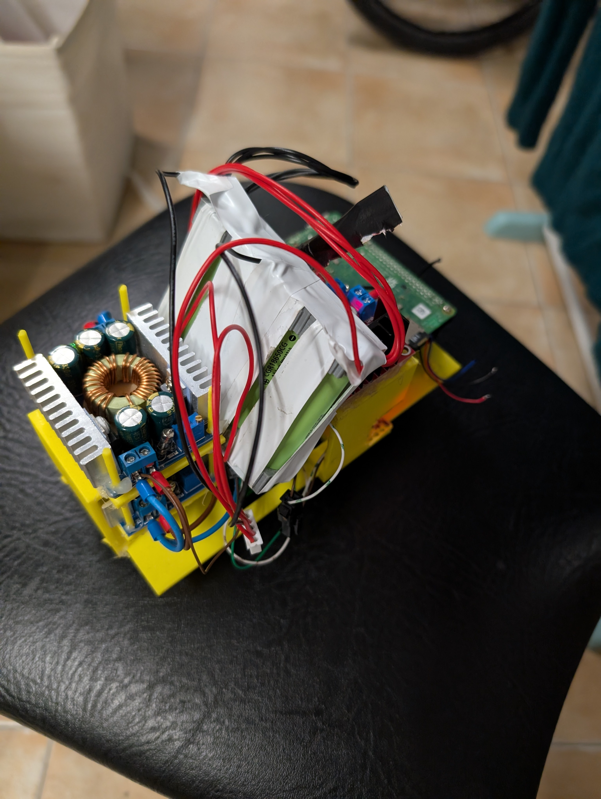

# NotAPi_WRO_2025

## 1. Mobility Management
Our car is built on a modified RC car bottom chassis, retaining only the wheels, central axle, and front drive shaft. Steering is controlled by a servo connected to a custom crank mechanism, allowing a 140º turning range. The servo's circular motion translates into horizontal movement of the crank, which directs the wheels. As this is a custom solution and not properly engineered the turning angle is not linear, this has difficulted our coding and logic.

For propulsion, we're using a generic DC gearbox motor which is mounted on the chassis and connected to a custom-designed aluminium gear (CNC'd for precision). This gear reduces speed (which was a mistake from our part) and transfers power to the main axle. The motor is driven by an L298N motor controller, ensuring an easy motor control. All additional structural components were 3D-printed for lightweight durability and modularity.

**Key Features:**
- Servo-driven steering with 140º range
- Custom aluminium gear for high endurance
- L298N motor controller for reliable motor control

---

## 2. Power and Sensor Management
### Power System
The robot is powered by a **4S 18650 Li-ion battery (14.4V, 2200mAh theoretical)**. To distribute power efficiently, we use two buck voltage regulators:
- A **12V regulator** for the motor (note: overvolting at 12V causes the motor to go faster, however it increases the likelyhood for it to burn (and even catch fire if not supervised)).
- A **5V regulator** for all other components, routed through a custom-designed PCB for easy power distribution.

### Sensors
The car employs a multi-sensor array for navigation:
- **3x VL53LXX-V2 Time-of-Flight (ToF) sensors** (front and both sides) for precise distance measurement. They replaced the Lidar sensors (TF Mini) we were previously using as they were not reliable at all.
- **Camera:** *Temporarily removed*—planned future reintegration of a **Raspberry Pi Cam (220º FOV with fisheye lens)**.

### Processing Unit:
- **Raspberry Pi 4 (4GB)** running **Raspbian** for stable operation.  

---

## 3. Obstacle Management & Navigation Logic
The car autonomously navigates by:
1. **Advancing** until the front wall is ~45cm away.
2. **Measuring distances** to walls (sides) using the ToF sensors.
3. **Checking side distances** to determine the optimal turning direction (away from closer obstacles).
4. **Executing turns** until the outer sensor detects an increase of the distance, as it indicates the car has rotated +90º.
5. **Repeat** until the battery runs out, the sensors fail or we manually stop the car, as it currently doesn't have a way to check when it has made all 12 turns.

**Current Status:**  
- **Obstacle/block algorithm is non-functional**—pending camera integration and image processing code.    

**Known Issues:**  
- Motor overheating after **6–8 minutes of continuous use**. This is due to the overvolting. Mitigations include intermittent cooling pauses or future hardware adjustments.  
- Sensors having incorrect readings. This is due to vibrations and elevated center of mass of the vehicle. Mitigations include screwing and calibrating the sensors before every round.
- Battery undervolting. This is due to the lack or a battery protection circuit. Mitigations include checking the battery voltage frequently.
  
---

## 4. Planned Future Improvements  
- **Obstacle Algorithm:** Integrate the camera with the car and code the image processing.  
- **Brushless/improved motor:** Replace the motor with one that is faster and powerful enough (no need to overvolt) (encoder may be helpful).
- **Chassis structure and design** Redesign the car's chassis to add stability and correct angle for the sensors.
- **Mounting system for the ToFs** Currently they're screwed directly in the plastic. A correct mounting solution is necessary for stable operation.
